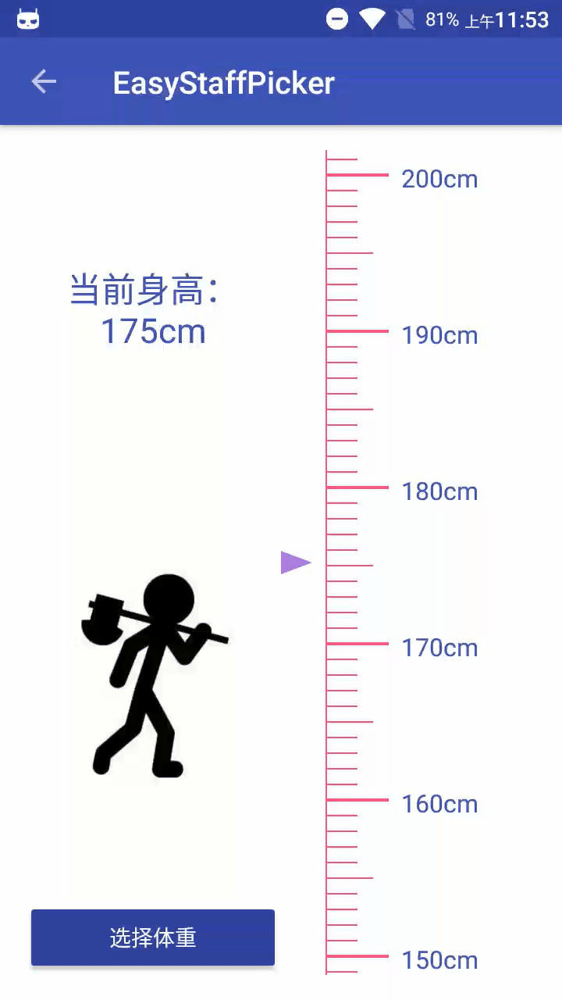

# EasyStaffPicker

一个可定制的简易版标尺选择器。

---

## 下载地址

[](https://jitpack.io/#NingOpenSource/EasyStaffPicker)

## Example



下载地址：[example-debug.apk](https://raw.githubusercontent.com/NingOpenSource/EasyStaffPicker/master/screenshot/example-debug.apk)

## xml使用

```

        <org.ning.EasyStaffPicker.EasyScrollStaffPicker
                android:id="@+id/scrollStaffPickerView"
                android:layout_width="0dp"
                android:layout_height="wrap_content"
                android:layout_weight="1"
                EasyStaffPicker:isHorizontal="false"
                EasyStaffPicker:isReverseOrder="true"
                EasyStaffPicker:staff_end="260"
                EasyStaffPicker:staff_line_width="1dp"
                EasyStaffPicker:staff_secondary_unit_tag_line_size="30dp"
                EasyStaffPicker:staff_start="100"
                EasyStaffPicker:staff_unit_line_color="@color/colorAccent"
                EasyStaffPicker:staff_unit_line_size="20dp"
                EasyStaffPicker:staff_unit_line_width="1dp"
                EasyStaffPicker:staff_unit_name="cm"
                EasyStaffPicker:staff_unit_sencodary_tag_line_width="1dp"
                EasyStaffPicker:staff_unit_tag_line_size="40dp"
                EasyStaffPicker:staff_unit_tag_line_width="2dp"
                EasyStaffPicker:staff_unit_tag_textColor="@color/colorPrimary"
                EasyStaffPicker:staff_unit_tag_textSize="16sp"
                EasyStaffPicker:staff_guide_color="#ae67df"
                EasyStaffPicker:staff_unit_value="10dp" />

```

## 回调监听

标尺值改变时会调用监听类

```

	/**
	 * 监听数值变化
	 *
	 * @author yanning<br>
	 *         2016年3月21日上午10:56:15<br>
	 */
	public static interface OnStaffValueChangeListener {
		/**
		 *
         * @param unit_index    单位值
         */
		public void onChange(int unit_index);

        /**
         * @param unit_tag_name 代表的实际值（一般为物理值，包含单位名称）
         * @param unit_tag_value          代表实际值（一般为物理值，不包含单位名称）
         */
		public void onChangeValue(String unit_tag_name,double unit_tag_value);
	}

```


使用方式

```

EasyScrollStaffPicker easyScrollStaffPicker=(EasyScrollStaffPicker)findViewById(R.id.scrollStaffPickerView);
        easyScrollStaffPicker.setOnStaffValueChangeListener(new EasyScrollStaffPicker.OnStaffValueChangeListener() {

            @Override
            public void onChange(int unit_index) {
                // TODO Auto-generated method stub

            }

            @Override
            public void onChangeValue(String unit_tag_name, double unit) {
                tv_value.setText("当前身高："+unit_tag_name);
            }
        });

```

